QSWAT插件操作流程一览
##########################

	
安装
====

略

对DEM文件进行处理
=================

* 获取DEM数据文件

::

	147->
		/data/DEM/->
			china.tif

或
	
::

	147->
		​ /data/DEM/dem/->
			*各省.tif

* 导入图层

:: 

	Layer->
		 Add Layer->
			Add Raster Layer
				[...]
					打开所在省/国/洲的tif文件（DEM数据文件）                  
						[Add]                      
							[Close]
								

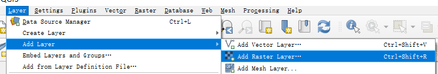
    

* 剪裁处理

::

	Raster->     
		Extraction->         
			Clip raster by extent     
				在Clipping extent栏下填入比目标流域稍大一些的经纬度区域范围     
					[run]               
						[close]
							

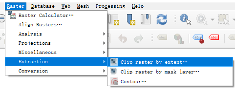

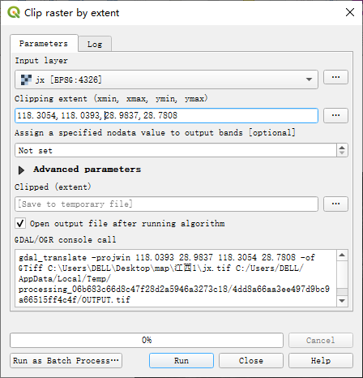

* 得到需要的区域后删去原图层

::

	工具栏空白处右键，给Layer Panel栏打勾     
		左侧出现图层工具栏         
			右键删去原图层，保留裁剪后的图层
				

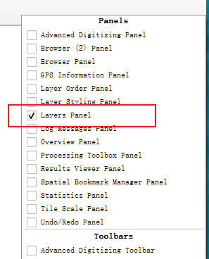

* 投影处理

::

	Raster->     
		Projections->         
			Warp(reproject)             
				在Target CRS栏右方点击小按钮，进入Selector                 
					取消勾选No projection
						在Filter搜索栏输入关键词，查找目标投影格式（此处需自行查找相关经纬度区域对应的格式，可百度搜索UTM zone）
							 [ok]
								 在Reprojected栏输入保存目录和文件名([...]->save to file)
									 [run]
										 [close]
											

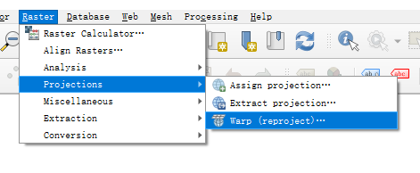
 

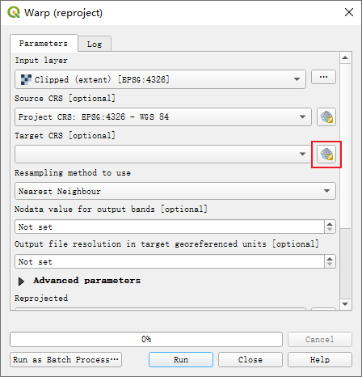

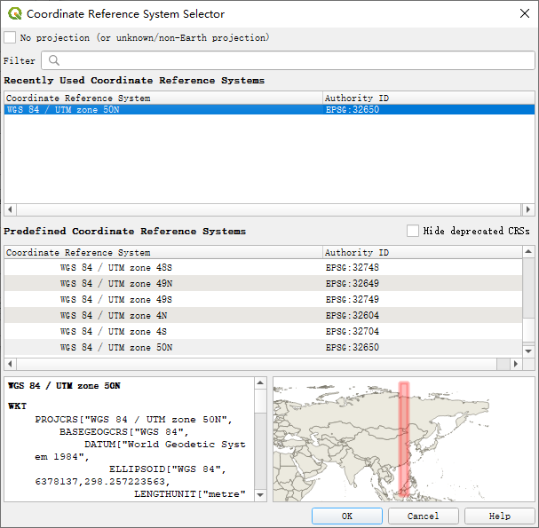

landuse和soil文件处理
=====================

* 获取数据

::

	https://swat.tamu.edu/data/

	landuse map & soil map

* 导入图层

* 投影处理（同DEM）

QSWAT操作步骤
===============

* 勾选QSWAT插件

::

	Plugins->
	     Manage and Install Plugins
	         搜索栏输入QSWAT
	             勾选QSWATPlus3_64
	                 [close]
	                     查看是否出现“S+”图标
							

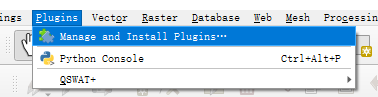

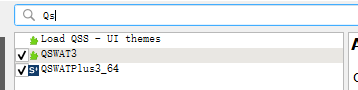

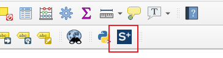

* 打开S+图标

创建项目
~~~~~~~~~~~~~~~~

::

	[New Project] 
		选择目标项目文件夹的父目录
			[选择文件夹]         
				输入项目名             
					[OK]

[Delineate Watershed]
~~~~~~~~~~~~~~~~~~~~~~~~~~~~~~~~~~

::

	*项目路径不得出现中文*

* 
	::

		[Delineate Watershed]
			Select DEM [...]
				 选取上面剪裁投影处理过的DEM数据tif文件

* 
	::

		[Create streams]（可以调整Channel/Stream threshold和Cells，或者直接保持默认值） 等待一段时间，地图上会出现流域河流分布线

* 
	::

		[Draw inlets/outlets] 在出水口打上小三角形（必须打在河流线上，可以隐藏背景图，然后放大河流再标记）(七一水库625045，3189516)

* 
	::

		[Select inlets/oulets] 选中刚才的标记小三角形并[save]
			右侧会出现"1 selected"

* 
	::

		[create watershed] 等待一段时间，会自动剪裁掉无用的河流支流，并形成一个红色包围圈

* 
	::

		create landscape [Create]
			选一种landscape进行创建，第三种“Branch length”最慢，可以选第一种“Buffer channels”
				[Create]
					等待一段时间，[Done]

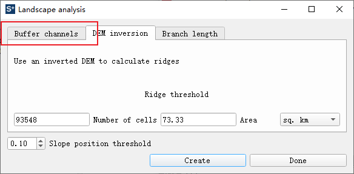

* ::

        [OK]

[Create HRUs]
~~~~~~~~~~~~~~~~~~~~~~~~~~~~~

    ::

        [Create HRUs]

* ::

        Select landuse map [...]
            选取上面投影处理过的landues数据tif文件
                Landuse table 改选成[global_landuses]

* ::

        Select soil map [...]
            选取上面投影处理过的soil数据tif文件
                Soil table 改选成[global_soils]

* ::

        Usersoil table 改选成[global_usersoil]

* ::

        [Select floodplain map (optional)]  改选成     [bufferflood10.tif]
            (取决于Delineate Watershed中create的landscape)

* ::

        勾选“Generate FullHRUs shapefile”

* ::

        Set slope bands
            10 [Insert]

* ::

        Short channel merge
            2

* ::

        [Read]

* ::

        [Create HRUs]

[Edit Inputs and Run SWAT]
~~~~~~~~~~~~~~~~~~~~~~~~~~~~~~~~~~~

    ::

        [Edit Inputs and Run SWAT]

* 左侧五个图标之一：[Project setup]

    ::

        [Start editing SWAT+ inputs]

* 左侧五个图标之二：[Edit SWAT+ inputs]

* 下载天气数据<https://bitbucket.org/swatplus/swatplus.editor/downloads/swatplus\_wgn.sqlite>_
    
* ::

        Weather Generator
            [Import Data]
                Database file [Browse]
                    选择上述下载的天气数据
                        Table name in database
                            [wgn_cfsr_world]
                                [Start Import]

* ::

        Time
            按需选择
                [Save Changes]

* ::

        Print
            勾选  Object:[channel_sd]-[Daily]
                [Save Changes]

* 左侧五个图标之三：[Write input files]

    ::

        [Save & Write Files]

* 左侧五个图标之四：[Run the model]

    ::

        [Run SWAT+]

* 左侧五个图标之五：[Analyze model output]

    ::

        [Save & Write Files]
            [Exit SWAT+ Editor]

[Visualise]
~~~~~~~~~~~~~~~~~~

    ::

        [Visualise]

* ::

        Choose SWAT+ output table
            [channel_sd_day]

* ::

        Choose period
            选择需要的时间段

* ::

        选择[plot]栏

* ::

        Unit
            选择需要的通道
                Variable
                    选择需要的变量[flo_out]
                        [Add plot]
                            [Plot]
                                选择要保存的地址与文件名
                                    [保存]
